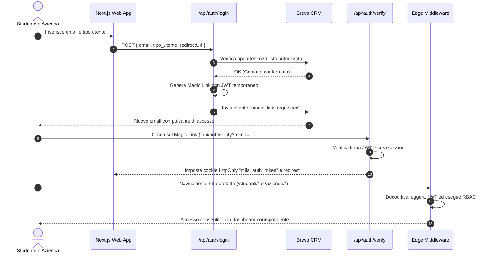

# MIIA Website & Career Platform

[](https://nextjs.org/)
[](https://react.dev/)
[](https://www.typescriptlang.org/)
[](https://tailwindcss.com/)
[](https://heroui.com/)
[](https://www.storyblok.com/)
[](https://neon.tech/)
[](https://www.brevo.com/)
[](https://cloud.google.com/storage)

Piattaforma web istituzionale e Career Board di **[Made in Italy Academy](https://www.madeinitalyacademy.it)** (MIIA), scuola di alta formazione specializzata in corsi per Interior Design, Arredatori, Stilisti e Modellisti.

L'applicazione integra un **Headless CMS (Storyblok)** per la gestione dinamica dei contenuti con un portale applicativo completo (**Bacheca Lavoro Triveneto**) che connette gli studenti diplomati dell'accademia con le aziende del settore.

---

## Indice

- [Panoramica Funzionale](#panoramica-funzionale)
  - [Sito Web Istituzionale](#1-sito-web-istituzionale)
  - [Piattaforma Job / Bacheca Lavoro](#2-piattaforma-job--bacheca-lavoro)
  - [Autenticazione Passwordless (Magic Link)](#3-autenticazione-passwordless-magic-link)
  - [CRM & Marketing Automation](#4-crm--marketing-automation)
  - [Archiviazione Sicura Documenti](#5-archiviazione-sicura-documenti)
- [Stack Tecnologico](#stack-tecnologico)
- [Architettura e Struttura Directory](#architettura-e-struttura-directory)
- [Modello Dati (Neon PostgreSQL)](#modello-dati-neon-postgresql)
- [Eventi e Trigger CRM (Brevo)](#eventi-e-trigger-crm-brevo)
- [Configurazione Variabili d'Ambiente](#configurazione-variabili-dambiente)
- [Installazione e Sviluppo Locale](#installazione-e-sviluppo-locale)
  - [Prerequisiti](#prerequisiti)
  - [Setup Iniziale](#setup-iniziale)
  - [Script NPM Disponibili](#script-npm-disponibili)
  - [Sviluppo Locale con Proxy SSL (HTTPS)](#sviluppo-locale-con-proxy-ssl-https)
- [Flusso di Autenticazione e Middleware RBAC](#flusso-di-autenticazione-e-middleware-rbac)
- [Deployment](#deployment)

---

## Panoramica Funzionale

### 1. Sito Web Istituzionale
- **Pagine dinamiche da Headless CMS**: Sincronizzazione in tempo reale con Storyblok tramite Pages Router dinamico (`pages/[...slug].tsx`) e componenti modulari React.
- **Catalogo Corsi & Progetti**: Schede dettagliate per i percorsi formativi di Interior Design e Moda.
- **Iscrizione Open Day**: Form integrato con sincronizzazione contatti su Brevo e pagina di conferma/feedback personalizzata (`pages/conferma.tsx`).
- **Mappe Interattive**: Integrazione Mapbox GL per la visualizzazione delle sedi e delle aree formative.

### 2. Piattaforma Job / Bacheca Lavoro
- **Area Studenti (`/studenti/*`)**:
  - Riservata esclusivamente agli studenti diplomati MIIA (validati tramite liste CRM Brevo).
  - Consultazione delle offerte di lavoro pubblicate dalle aziende partner nel Triveneto (13 province: BL, PD, RO, TV, VE, VR, VI, BZ, TN, GO, PN, TS, UD).
  - Candidatura istantanea con 1 clic alle posizioni aperte.
  - Gestione del profilo: competenze tecniche, portfolio, disponibilità a trasferte, stato ricerca attiva e caricamento/aggiornamento del CV.
  - Monitoraggio in tempo reale dello stato delle proprie candidature (*in revisione*, *validata*, *letta*, *accettata*, *rifiutata*).
- **Area Aziende (`/aziende/*`)**:
  - Registrazione aziendale e accesso rapido.
  - Gestione del profilo aziendale (dati referente, logo, descrizione, sito web).
  - Creazione, modifica e chiusura delle inserzioni di lavoro (contratto, RAL, monte ore, trasferte, esperienza, competenze richieste, lingue straniere).
  - Visualizzazione dell'elenco dei candidati per ciascuna inserzione con tracciamento della data di prima apertura e download del CV.
- **Backoffice Amministratore (`/admin/*`)**:
  - Dashboard riservata al team interno di MIIA con autenticazione dedicata.
  - Monitoraggio globale di tutte le candidature inviate sulla piattaforma.
  - Pipeline di revisione e validazione delle candidature (*in_revisione* &rarr; *validata* / *rifiutata*).
  - Creazione e gestione diretta di inserzioni di lavoro.

### 3. Autenticazione Passwordless (Magic Link)
- Accesso sicuro per studenti e aziende senza password memorizzate: l'utente inserisce la propria email e riceve un **Magic Link tokenizzato** valido per un periodo limitato.
- Sessioni utente gestite tramite **token JWT** salvati in cookie sicuri `HttpOnly` (`miia_auth_token`).
- **Next.js Edge Middleware** (`middleware.ts`):
  - Protegge le rotte `/aziende/:path*`, `/studenti/:path*`, `/lavoro/inserzioni/:path*`.
  - Gestisce il deep-linking intelligente: salva la destinazione originale richiesta prima del login e reindirizza l'utente alla pagina desiderata post-autenticazione.
  - Implementa il **Role-Based Access Control (RBAC)** isolando le dashboard per ruolo.

### 4. CRM & Marketing Automation
- Integrazione diretta con le REST API v3 di **Brevo** (`modules/brevo.ts`).
- Sincronizzazione automatica delle anagrafiche contatti e liste (Studenti diplomati, Aziende registrate, contatti lead, iscritti Open Day).
- Tracciamento eventi personalizzati (`trackEvent`) per innescare workflow di marketing automation ed email transazionali.

### 5. Archiviazione Sicura Documenti
- Integrazione con **Google Cloud Storage** (`modules/google.ts`):
  - **Bucket Pubblico**: Gestione di asset grafici e loghi aziendali.
  - **Bucket Privato**: Archiviazione riservata dei CV degli studenti, accessibili solo tramite API autenticata con download tracciato a fini di audit e statistiche.

---

## Stack Tecnologico

| Livello | Tecnologie |
| :--- | :--- |
| **Framework Frontend** | [Next.js 15](https://nextjs.org/) (Pages Router), [React 19](https://react.dev/), [TypeScript 5](https://www.typescriptlang.org/) |
| **Styling & UI Components** | [Tailwind CSS 3](https://tailwindcss.com/), [HeroUI 2](https://heroui.com/), [Tailwind Variants](https://tailwind-variants.org/) |
| **Animazioni & Slider** | [Framer Motion](https://www.framer.com/motion/), [Swiper](https://swiperjs.com/) |
| **Headless CMS** | [Storyblok](https://www.storyblok.com/) (`@storyblok/react`, CLI per components sync e typegen) |
| **Database** | [Neon Serverless PostgreSQL](https://neon.tech/) (`@neondatabase/serverless`) |
| **Cloud Storage** | [Google Cloud Storage](https://cloud.google.com/storage) (`@google-cloud/storage`) |
| **CRM & Email** | [Brevo API v3](https://www.brevo.com/) (ex Sendinblue) |
| **Mappe** | [Mapbox GL](https://www.mapbox.com/) / `react-map-gl` |
| **Autenticazione & Sicurezza** | [JSON Web Tokens](https://github.com/auth0/node-jsonwebtoken) (JWT), Next.js Edge Middleware |
| **Privacy & Cookie** | [@mep-agency/next-iubenda](https://www.iubenda.com/) |

---

## Architettura e Struttura Directory

```text
miia-website/
├── .storyblok/              # Tipi TypeScript generati e componenti esportati da Storyblok
├── components/              # Componenti UI riutilizzabili
│   ├── admin/               # Componenti per il backoffice amministratore (AdminApplicationsList)
│   ├── banners/             # Banner promozionali ed eventi
│   ├── business/            # Componenti dashboard azienda (modali inserzioni, candidati, ecc.)
│   ├── cards/               # Card per articoli, persone, progetti
│   ├── grid/                # Griglie di layout e filtri
│   ├── shared/              # Componenti condivisi (LogoutButton, AlertModal)
│   ├── student/             # Componenti profilo studente (StudentProfileModal)
│   ├── map.tsx              # Componente mappa interattiva Mapbox
│   └── ...                  # Componenti Storyblok mappati (hero, slider, sezioni, ecc.)
├── config/                  # Configurazioni globali (font, relazioni Storyblok, auth, versioni)
├── modules/                 # Logica di business, servizi e database
│   ├── applications/        # Modulo DB e tipizzazioni candidature (Neon Postgres)
│   ├── jobs/                # Modulo DB e tipizzazioni inserzioni lavoro
│   ├── user/                # Servizio sincronizzazione utente/CRM
│   ├── auth.ts              # Helper generazione/verifica token e Magic Link
│   ├── brevo.ts             # Client HTTP API Brevo (v3) per contatti ed eventi
│   ├── db.ts                # Client SQL serverless Neon
│   ├── google.ts            # Client Google Cloud Storage (upload bucket pubblico/privato)
│   ├── sanitize.ts          # Normalizzazione e ottimizzazione payload
│   └── storyblok.ts         # Inizializzazione Storyblok client e componenti
├── pages/                   # Routing dell'applicazione (Next.js Pages Router)
│   ├── admin/               # Pagine backoffice (/admin/login, /admin/profilo, candidati)
│   ├── api/                 # API Routes (auth, job, admin, user, crm, preview, openday)
│   ├── aziende/             # Pagine area aziende (/aziende/login, /aziende/profilo, candidati)
│   ├── lavoro/              # Bacheca lavoro pubblica/autenticata (/lavoro/inserzioni/[id])
│   ├── studenti/            # Pagine area studenti (/studenti/login, /studenti/profilo)
│   ├── [...slug].tsx        # Risolutore pagine dinamiche da Storyblok CMS
│   ├── conferma.tsx         # Pagina di atterraggio e feedback form (Open Day, lead)
│   └── index.tsx            # Homepage istituzionale
├── public/                  # Asset statici (immagini, loghi, favicon)
├── styles/                  # File CSS globali (Tailwind)
├── middleware.ts            # Next.js Edge Middleware (RBAC e redirezioni)
├── tailwind.config.ts       # Configurazione Tailwind CSS e tema HeroUI
├── tsconfig.json            # Configurazione TypeScript e path aliases (@components, @modules, ecc.)
└── package.json             # Dipendenze e script npm
```

---

## Modello Dati (Neon PostgreSQL)

La persistenza della Bacheca Lavoro è gestita su Neon PostgreSQL tramite due tabelle relazionali principali:

### Tabella `jobs`
Memorizza le posizioni aperte inserite dalle aziende o dagli amministratori.

| Campo | Tipo | Descrizione |
| :--- | :--- | :--- |
| `id` | `UUID / SERIAL` | Identificativo univoco dell'inserzione (chiave primaria) |
| `company_email` | `VARCHAR` | Email dell'azienda inserzionista |
| `title` | `VARCHAR` | Titolo dell'opportunità professionale |
| `description` | `TEXT` | Descrizione completa della posizione e requisiti |
| `provincie` | `TEXT[]` | Elenco province del Triveneto selezionate |
| `tipo_contratto` | `VARCHAR` | `stage`, `determinato`, `indeterminato`, `partita_iva`, `apprendistato` |
| `ral` | `VARCHAR` | Range retributivo annuo lordo (opzionale) |
| `orari_lavoro` | `VARCHAR` | `full_time`, `part_time`, `ibrido` |
| `trasferte` | `VARCHAR` | `no`, `occasionali`, `frequenti` |
| `grado_esperienza` | `VARCHAR` | `prima_esperienza`, `junior`, `intermedio`, `senior` |
| `competenze` | `TEXT[]` | Competenze tecniche richieste |
| `lingue` | `TEXT[]` | Lingue straniere richieste (`inglese`, `tedesco`, `francese`, `spagnolo`) |
| `status` | `VARCHAR` | Stato inserzione: `attiva`, `chiusa`, `eliminata` |
| `created_at` | `TIMESTAMP` | Data e ora di creazione |
| `updated_at` | `TIMESTAMP` | Data e ora di ultimo aggiornamento |

### Tabella `applications`
Memorizza le candidature inviate dagli studenti per una specifica inserzione.

| Campo | Tipo | Descrizione |
| :--- | :--- | :--- |
| `id` | `UUID / SERIAL` | Identificativo univoco della candidatura |
| `job_id` | `VARCHAR / INT` | Riferimento alla posizione in `jobs.id` |
| `student_email` | `VARCHAR` | Email dello studente diplomato candidato |
| `cv_url` | `VARCHAR` | Percorso/URL al CV archiviato su Google Cloud Storage |
| `status` | `VARCHAR` | `in_revisione`, `validata`, `letta`, `accettata`, `rifiutata` |
| `applied_at` | `TIMESTAMP` | Data e ora di invio candidatura |
| `viewed_at` | `TIMESTAMP` | Timestamp della prima visualizzazione da parte dell'azienda |
| `cv_downloaded_at`| `TIMESTAMP` | Timestamp del primo download del file CV da parte dell'azienda |

> **Vincolo di unicità**: Una combinazione univoca `(job_id, student_email)` impedisce candidature duplicate alla stessa offerta.

---

## Eventi e Trigger CRM (Brevo)

Il sistema invia eventi tracciati (`trackEvent`) alle API di Brevo per gestire notifiche transazionali e percorsi di marketing automation:

### 1. `company_registered`
- **Descrizione**: Scatenato alla registrazione di una nuova azienda partner.
- **Destinatario**: Email Azienda.
- **Proprietà Payload**: `azienda` (nome azienda), `referente`, `sms`, `logo_url`.

### 2. `magic_link_requested`
- **Descrizione**: Richiesta di autenticazione passwordless.
- **Destinatario**: Email Utente (Azienda o Studente).
- **Proprietà Payload**: `magic_link` (URL tokenizzato per il login diretto), `tipo_utente`, `redirect_url`.

### 3. `job_posted`
- **Descrizione**: Pubblicazione di una nuova inserzione di lavoro.
- **Destinatario**: Email Azienda.
- **Proprietà Payload**: `job_id`, `job_title`, `tipo_contratto`, `ral`, `provincie`, `job_url`, `azienda_nome`, `referente`.

### 4. `job_applied`
- **Descrizione**: Invio candidatura da parte di uno studente.
- **Destinatario**: Email Studente.
- **Proprietà Payload**: `job_id`, `job_title`, `company_name`.

### 5. `cv_downloaded`
- **Descrizione**: L'azienda o l'amministratore effettua il primo download del CV di un candidato.
- **Destinatario**: Email Recruiter / Azienda / Admin.
- **Proprietà Payload**: `application_id`, `file_path`, `tipo_utente`.

### 6. `application_accepted` / `application_rejected`
- **Descrizione**: L'amministratore valida o scarta la candidatura nel backoffice.
- **Destinatario**: Email Studente.
- **Proprietà Payload**: `job_title`, `company_name`, `status`.

### 7. `candidate_received`
- **Descrizione**: Notifica all'azienda con la scheda dello studente validato dal team MIIA (triggerato quando `status === 'validata'`).
- **Destinatario**: Email Azienda.
- **Proprietà Payload**: `job_id`, `job_title`, `student_name`, `student_email`, `cv_url`.

---

## Configurazione Variabili d'Ambiente

Creare un file `.env.local` nella radice del progetto prendendo come riferimento il template `.env.example`:

```bash
cp .env.example .env.local
```

### Elenco Variabili

| Variabile | Obbligatoria | Descrizione |
| :--- | :---: | :--- |
| `STORYBLOK_SPACE_ID` | Sì | ID numerico dello Space Storyblok |
| `NEXT_PUBLIC_IS_PREVIEW` | Sì | Abilita la modalità preview Storyblok (`true` o `false`) |
| `NEXT_PUBLIC_STORYBLOK_PREVIEW`| Sì | Token API Preview di Storyblok |
| `STORYBLOK_MANAGEMENT` | Opzionale | Token Management API Storyblok (necessario per sync CLI) |
| `STORYBLOK_LOGOS_FOLDER_ID` | Opzionale | ID cartella Storyblok per i loghi aziendali |
| `STORYBLOK_BUSINESS_FOLDER_ID`| Opzionale | ID cartella Storyblok per le storie azienda |
| `STORYBLOK_STUDENT_FOLDER_ID` | Opzionale | ID cartella Storyblok per le storie studente |
| `STORYBLOK_JOBS_FOLDER_ID` | Opzionale | ID cartella Storyblok per le storie offerte |
| `BREVO_API_KEY` / `BREVO_TOKEN` | Sì | Chiave API REST v3 per Brevo |
| `BREVO_MANAGEMENT` | Opzionale | Token addizionale per chiamate management Brevo |
| `BREVO_STUDENT_LIST_ID` | Sì | ID lista Brevo contenente gli studenti diplomati autorizzati (default `42`) |
| `BREVO_BUSINESS_LIST_ID`| Sì | ID lista Brevo contenente le aziende registrate (default `43`) |
| `NEXT_PUBLIC_MAPBOX_TOKEN` | Sì | Token pubblico Mapbox GL per il rendering delle mappe |
| `JWT_SECRET` | Sì | Chiave segreta per la firma e verifica dei token JWT |
| `NEXT_PUBLIC_BASE_URL` | Sì | URL base dell'applicazione per i Magic Link (es. `http://localhost:8080`) |
| `DATABASE_URL` | Sì | Stringa di connessione a Neon Postgres (`postgresql://...`) |
| `ADMIN_EMAIL` | Sì | Email di accesso per il backoffice amministratore (`/admin/login`) |
| `ADMIN_PASSWORD` | Sì | Password di accesso per il backoffice amministratore |
| `GCS_BUCKET_PUBLIC` | Sì | Nome bucket Google Cloud Storage per gli asset pubblici |
| `GCS_BUCKET_PRIVATE` | Sì | Nome bucket Google Cloud Storage per i CV privati |
| `GCS_CLIENT_EMAIL` | Sì | Email del service account Google Cloud con permessi di storage |
| `GCS_PRIVATE_KEY` | Sì | Chiave privata del service account Google Cloud |

---

## Installazione e Sviluppo Locale

### Prerequisiti
- **Node.js**: Versione `>= 20.x`
- **Gestore pacchetti**: `npm`, `pnpm` o `yarn`

### Setup Iniziale

1. **Clonare il repository**:
   ```bash
   git clone https://github.com/MadeInItalyAcademy/miia-website.git
   cd miia-website
   ```

2. **Installare le dipendenze**:
   ```bash
   npm install
   ```

3. **Configurare le variabili d'ambiente**:
   ```bash
   cp .env.example .env.local
   # Modificare .env.local con i valori appropriati
   ```

4. **Avviare il server di sviluppo**:
   ```bash
   npm run dev
   ```
   L'applicazione sarà disponibile su [http://localhost:8080](http://localhost:8080).

### Script NPM Disponibili

| Comando | Descrizione |
| :--- | :--- |
| `npm run dev` | Avvia il server di sviluppo Next.js sulla porta `8080` |
| `npm run proxy` | Avvia un reverse proxy HTTPS locale sulla porta `9080` verso la `8080` |
| `npm run build` | Esegue la compilazione di produzione dell'applicazione |
| `npm run start` | Avvia il server compilato in produzione sulla porta `9090` |
| `npm run lint` | Esegue il controllo del codice con ESLint 9 |
| `npm run cms` | Esegue il pull dei componenti da Storyblok e rigenera i tipi TypeScript |

### Sviluppo Locale con Proxy SSL (HTTPS)

Per testare il corretto funzionamento dei cookie di sessione `Secure` e per integrare l'editor visuale di Storyblok (che richiede l'embed iframe via HTTPS), è presente il tool `local-ssl-proxy`:

```bash
# Terminale 1: Server Next.js
npm run dev

# Terminale 2: Proxy SSL locale
npm run proxy
```

L'applicazione sarà accessibile via HTTPS su [https://localhost:9080](https://localhost:9080) utilizzando i certificati locali inclusi nel progetto (`localhost.pem` e `localhost-key.pem`).

---

## Flusso di Autenticazione e Middleware RBAC



1. **Richiesta**: L'utente richiede l'accesso specificando la propria email.
2. **Validazione CRM**: L'API verifica che l'email appartenga alla lista studenti diplomati o aziende autorizzate su Brevo.
3. **Magic Link**: Viene generato un link crittografato e inviato tramite email transazionale.
4. **Verifica & Cookie**: Al clic sul link, `/api/auth/verify` convalida il token, crea una sessione valida 7 giorni e imposta il cookie `miia_auth_token` (`HttpOnly`, `SameSite=Lax`).
5. **Controllo Accessi Edge (RBAC)**: Il file `middleware.ts` intercetta ogni richiesta alle aree protette, garantendo che gli studenti non possano accedere all'area aziende e viceversa, preservando la destinazione originale richiesta tramite parametri di redirect.

---

## Deployment

Il progetto è ottimizzato per il rilascio su **[Vercel](https://vercel.com/)**:

1. Collegare il repository GitHub a un nuovo progetto Vercel.
2. Configurare tutte le variabili d'ambiente presenti in `.env.local` nelle impostazioni del progetto su Vercel (*Settings &rarr; Environment Variables*).
3. Verificare che la versione di Node.js nelle impostazioni sia `20.x` o superiore.
4. Il comando di build predefinito è `next build` e la directory di output è `.next`.

---

&copy; Made in Italy Academy &mdash; Tutti i diritti riservati.